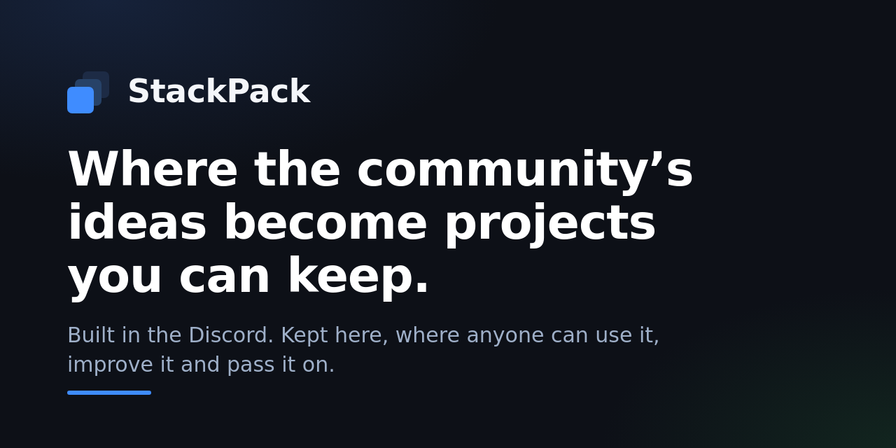
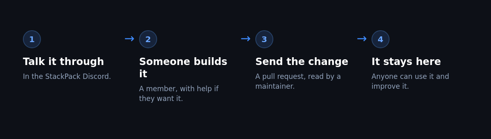

# StackPack on GitHub

This is where the things we talk about in the StackPack Discord turn into work you can keep, reuse and build on.

The Discord is for the conversation. GitHub is where the result lives.

## How a change gets in

## What lives here

- Ideas and requests that come out of the community.
- Projects that members have built and shared.
- Guides, prompts and resources anyone can use and improve.

## Join

1. Post your GitHub username in the introductions forum in the Discord.
2. You get an invitation to the organisation.
3. Accept it, and you can make your own repos and open pull requests.

## The three things you can do

- Make a repo for your own project.
- Send a change to an existing repo with a pull request.
- Ask for a repo when the community is working on something together.

## Sending a change

Read [CONTRIBUTING.md](CONTRIBUTING.md). It is five lines long.

## House rules

The same as the Discord. Be decent, credit people, no client's private work, no spam.
