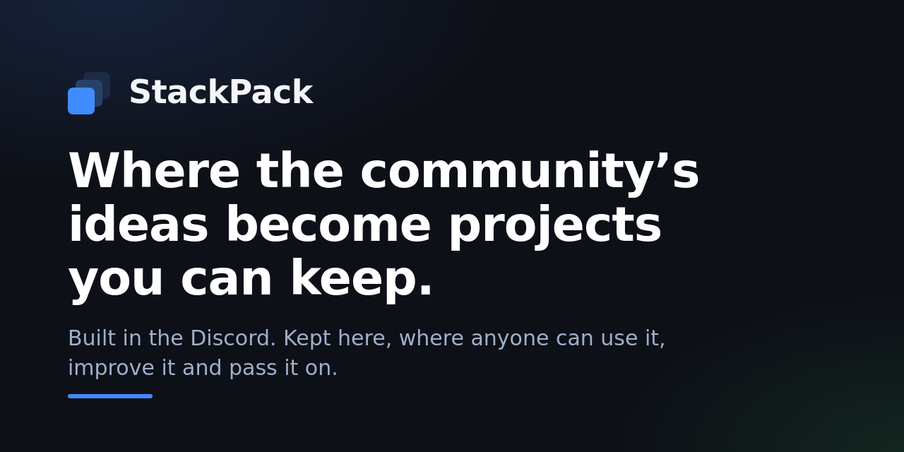

# StackPack on GitHub

The public side of StackPack: the tools we build, and the things worth keeping out of the chat.

The community lives in two places.

- **The group** is on Skool: [skool.com/stackpack](https://www.skool.com/stackpack/about), with the classroom, the workshops and the community feed.
- **The website** is [stackpack.app](https://stackpack.app), which carries the brief and the community rules.

This repository is the third place: where something somebody asked for in the Discord turns into a file that anyone can read, reuse and improve. Conversation happens in Discord. The result lives here.

## What is here

- **Tools we run.** Small, plain utilities, each with its own page. Start with [the security scanner](tools/), which checks everything before it lands in these repos.
- **The rules of this home.** Who may do what is in [MANAGEMENT.md](MANAGEMENT.md). How to send a change is in [CONTRIBUTING.md](CONTRIBUTING.md).
- **Member work.** Repos named after the member they were built for, holding the prompts, scripts and notes they asked for.

## What is not here

- The classroom and its lessons. Those live in the Skool group, and members keep them there.
- Anything about a client's or an employer's private work.
- Passwords, keys or personal details. The scanner refuses them.

## How this home runs

- Mike owns it. Johan runs the server the community's assistant works on.
- The community's assistant does the day to day writing: it makes the repos, writes what goes in them, and runs the security check on everything first.
- Asking for something is done in the Discord. Say what you want and what finished looks like. The assistant builds it and saves it here.
- If you already use GitHub, you are welcome to fork any public repo here and open a pull request. That path is in [CONTRIBUTING.md](CONTRIBUTING.md).

## Tools

Every tool carries its own page saying what it does, how to run it and what it does not promise.

- [secret_scan.py](tools/) - refuses keys, private key blocks and dangerous patterns before a file is admitted.

## Sending a change

Read [CONTRIBUTING.md](CONTRIBUTING.md). It is five lines long, and it applies to anybody, in the community or not.

## House rules

The same as the Discord. Be decent, credit people, no client's private work, no spam.
